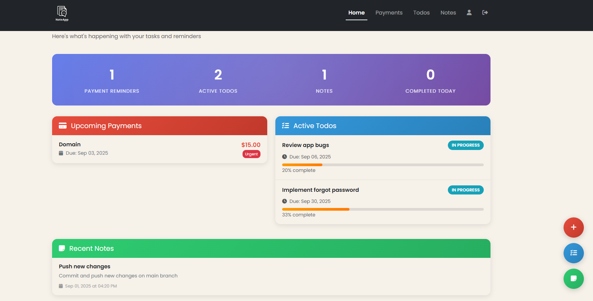
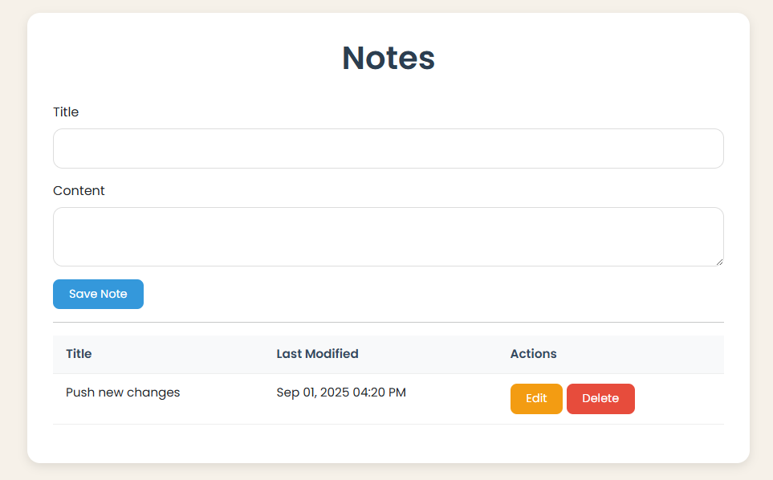
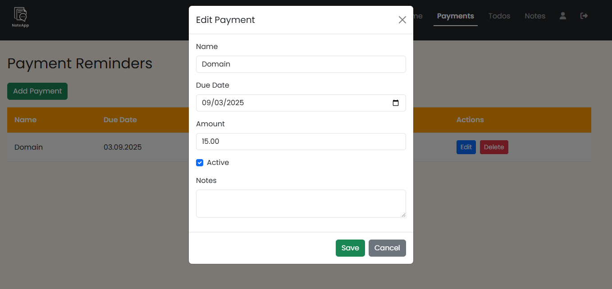

# Notes & Reminders App

A **Flask-based web app** for managing notes, payment reminders, and todos.  
Clean, responsive interface with quick actions for creating and managing items.

---

## Features

- Add, edit, and delete notes  
- Track payment reminders with due dates and amounts  
- Manage todos with status and progress tracking  
- Responsive UI built with Bootstrap  

---

## Known Limitations

- Profile management and forgot password are not implemented  
- Field history tracking is not available  
- App is still under active development; features may change  

---

## Tech Stack

- **Backend:** Flask, SQLAlchemy  
- **Database:** PostgreSQL  
- **Frontend:** HTML, Bootstrap 5, JavaScript  

---

## Screenshots & Demo

### Dashboard


### Notes


### Payments


---

## Setup (Development)

1. Clone the repository:
   ```bash
   git clone https://github.com/your-username/note-app.git
   cd note-app
    ```
   
2. Create a virtual environment:
   ```bash
    python -m venv .venv
    .venv\Scripts\activate     # Windows
    source .venv/bin/activate  # Linux/macOS
    pip install -r requirements.txt
    ```
   
3. Install dependencies:
    ```bash
    pip install -r requirements.txt
    ```
   
4. Create a `.env` file in the project root and add the following fields:
    ```env
    SECRET_KEY = 'yourSecretKey'
    
    # Database configurations
    DB_USERNAME = 'postgres'
    DB_PASSWORD = 'yourPassword'
    DB_HOST = 'localhost'
    DB_PORT = '5432'
    DB_NAME = 'notes'
    ```

5. Initialize the database using Flask-Migrate:
    ```bash
    flask db init        # Run only the first time
    flask db migrate -m "Initial migration"
    flask db upgrade
    ```

6. Run the app:
    ```bash
    flask run
    ```
   
7. Open you browser at:
    ```bash
    http://127.0.0.1:5000/
    ```
   
8. **Notes:**
   - Make sure PostgreSQL is running and the database specified in `.env` exists.
   - This app is intended for personal or small-scale use.
   - This app is still under development; some features (profile management, password reset, field history) are not implemented yet.
